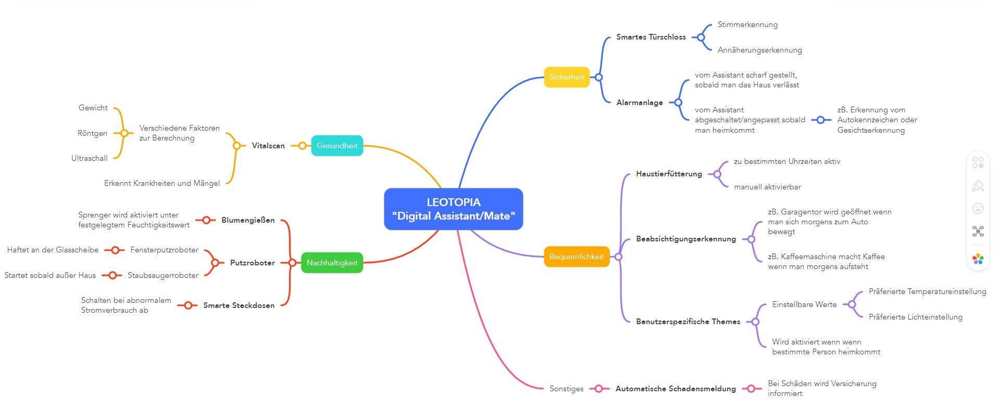

# leotopia

## Plan
Der Plan dieses Projektes in der 5. Klasse ist es, einerseits ein weitreichendes Konzept mit vielen verschiedenen Smart-Home Lösungen beim Immotopia Wettbewerb einzureichen und andererseits eine der Lösungen zu implementieren.
Es ergeben sich also folgende Ziele:
- Viele verschiedene Konzepte für Smart-Home Lösungen im Jahre 2050, gesammelt als einzelnes großes Konzept
 Beispielfoto (Isometric Room Design): 
 Ergänzung: Einzelne Komponenten der Konzepte (zB. Kameras, Sensoren, o.Ä.) werden mit Tooltips (Linien und Beschreibungstext) versehen.
- Eines der Konzepte als umgesetztes Produkt

## Ideen
Siehe [ideas folder](./ideas)

